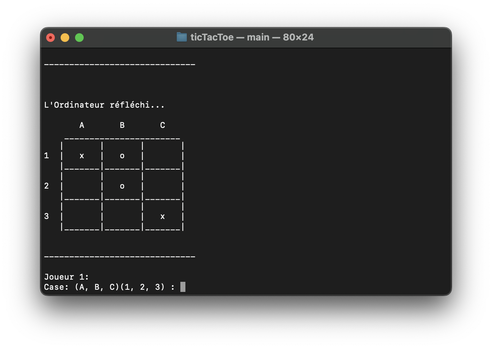

# CLI Games  
    
https://github.com/Jean1000levrai/CLI_Games   
   



## 📑 Table of Contents
[ℹ️ About](#-about)  
[✨ Features](#-features)  
[💾 Installation](#-installation)   
[📜 License](#-license)    
   

## ℹ️ About
This a project made to learn the C programming language.   

## ✨ Features
- Tictactoe
- Rock Paper Scissors
- Connect Four
- Mastermind   

## 💾 Installation
### 1. Prerequisites
 - C99 or above
 - A Compiler (e.g. gcc, clang, ...)
 - CMake >= 3.16     

### 2. Download

#### In the desired folder:

```
git clone https://github.com/Jean1000levrai/CLI_Games.git
cd CLI_Games
```
#### Browse to the game of your choice
```
cd ticTacToe    # for example
```

### 3. Compile
```
mkdir -p build
cd build/
cmake ..
make
```

### 4. Play on the command line interface!
```
./main
```

<br><br>
## 📜 License
This project is licensed under the MIT License — see the LICENSE file for details.
